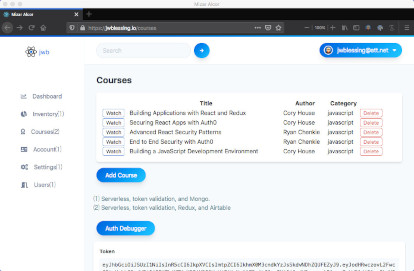

Redux project demonstrates Auth0 security with 
- openid
- oauth2
- roles 
- grant access
 
Preview application at [https://jwblessing.io](https://jwblessing.io) which allows signup emails like ping@pong.com
 
 
The project is based on several excellent courses presented by:

- [Cory House](https://github.com/coryhouse)
- [Ryan Chenkie](https://github.com/chenkie)

 
 
Sam is my assistant and does great work!
 

 
 
Likes to eat and monitor the bird bath
 

